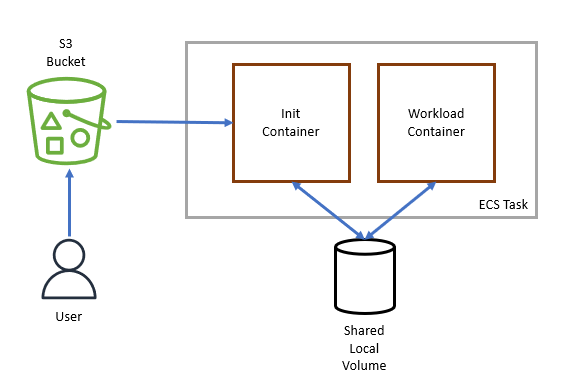
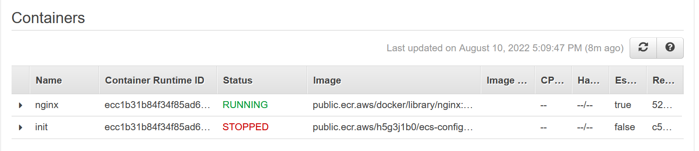
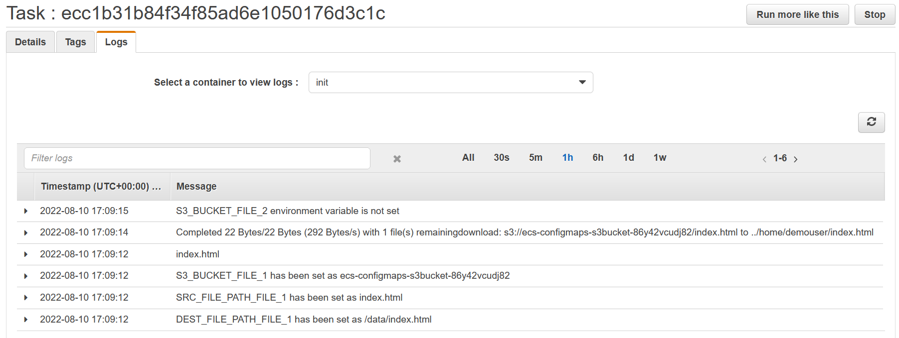
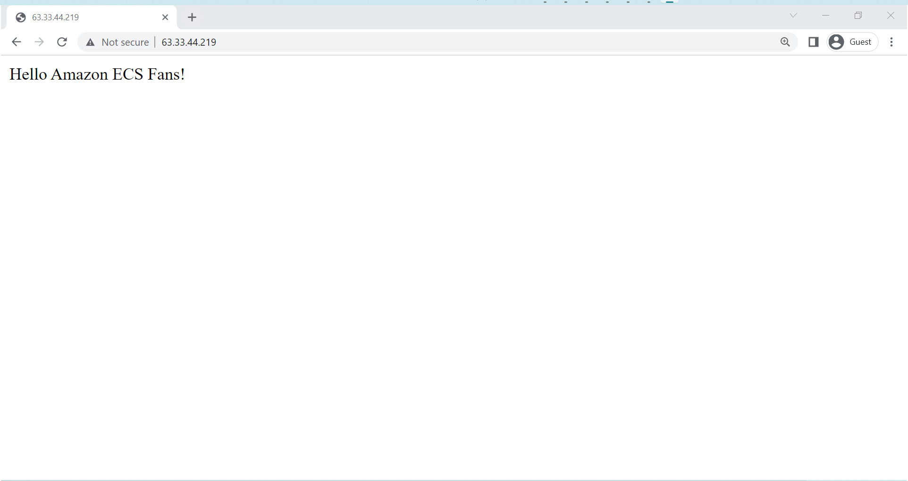

# Amazon ECS Config Maps Example

When running a containerized workload it is best practice to remove all
environment specific code, such as database passwords or API URLs, from your
container image. This ensures the workload is 1. portable and 2. does not
contain any sensitive data. It is then recommended to either use [Environment
Variables](https://docs.aws.amazon.com/AmazonECS/latest/developerguide/taskdef-envfiles.html)
or
[Secrets](https://docs.aws.amazon.com/AmazonECS/latest/developerguide/specifying-sensitive-data.html)
to pass back in the environment specific data back at runtime.

Many workloads also contain configuration files which are also environment
specific. Following the guidance above, we want to remove these environment
specific configuration files from our container image and pass them back in at
runtime. Depending on your container orchestrator, it may have a fist class
configuration file resource such as Kubernetes
[ConfigMaps](https://kubernetes.io/docs/concepts/configuration/configmap/) or
Docker Swarm [Configs](https://docs.docker.com/engine/swarm/configs/). Amazon
Elastic Container Service (Amazon ECS) does not have a native configuration file
resource.

Instead there are multiple ways to pass a configuration file into an Amazon ECS
Task, such as Amazon EFS or SSM Parameter Store. In in this project we show an
alternative approach leveraging Amazon S3 and an init container. This example is
supported on both Amazon ECS running on Amazon EC2 as well as Amazon ECS running
on AWS Fargate.

The architecture for this solution is as follows:

1. A user uploads a configuration file to an Amazon S3 bucket
2. A user creates a Amazon ECS Task Definition with 2 containers and 1 shared
   local volume.
    1. The first container is an "init" container. It will download the
       configuration file from S3 to the shared local volume. The first
       container will then exit successfully.
    2. The second container is the workload that requires the configuration
       file. The workload container will not start until the first container has
       exited successfully, leveraging Amazon ECS’s Depends On, and will load
       its configuration from the shared local volume.



## init container

The init container is built on top of the official
[aws-cli](https://hub.docker.com/r/amazon/aws-cli) container image, and contains
a single bash script that will run aws s3 cp to download each configuration
file. This image could have been built with an AWS SDK instead of the aws cli,
but with a design goal of keeping this simple, light weight and easy to
maintain, going down this path removes a lot of the dependency management.

The init container is configured with 3 environment variables for each
configuration file:

* `S3_BUCKET_FILE_*` - The S3 Bucket that contains the configuration file.
* `SRC_FILE_PATH_FILE_*` - The path within the S3 bucket to locate the
  configuration file `/prodfiles/nginx.conf`.
* `DEST_FILE_PATH_FILE_* `- The path within the init container you want to write
  the configuration file too. For example if the shared local volume is mounted
  to `/data` then this value could be `/data/nginx.conf`.

This same init container can be used for multiple configuration files, the
wildcard should be replaced with an integer for each configuration file you want
to use. For example `S3_BUCKET_FILE_1` , `SRC_FILE_PATH_FILE_1` ,
`DEST_FILE_PATH_FILE_1`  for the first configuration file and then
`S3_BUCKET_FILE_2` , `SRC_FILE_PATH_FILE_2` , `DEST_FILE_PATH_FILE_2` for the
second configuration file. By default the init container supports up to 20
configuration files.

### Building the init container:

```bash
$ git clone https://github.com/aws-samples/amazon-ecs-configmaps-example.git
$ cd amazon-ecs-configmaps-example/src/

# Build the Container Image
$ export DOCKER_BUILDKIT=1
$ export IMAGE_URI=<acccount_id>.dkr.ecr.<region>.amazonaws.com/ecs-configmap
$ export IMAGE_TAG=v0.1

$ docker build \
  --tag $IMAGE_URI:$IMAGE_TAG \
  .

# Push the Container Image to the Image Repository
$ docker push $IMAGE_URI:$IMAGE_TAG
```

### Example

The examples repository containers a simple nginx example. The directory
containers a cloudformation template with a Task Definition, as well as an
`index.html` file. In the walk through we will deploy an nginx container to ECS
using the upstream nginx image, we will also deploy a second container in the
ECS Task, the init container. The init container will download the `index.html`
from Amazon S3 and place it in the nginx container at runtime.

> Remember this index.html file could be any static configuration file that you
> want to pass into a workload at runtime. The example is simplistic by design,
> a more common example would be a Fluent bit configuration file.

When running the below the commands, ensure you have the container image and tag
Exported in your shell from the previous step. These instructions also assume
you have an existing VPC, Subnet, Security Group and ECS Cluster in your AWS
account. Its worth nothing these instructions are not deploying a highly
available, fault tolerant web server, it is simply highlighting the
functionality of the init container.

```bash
# Create the Task Definition
$ cd ../
$ aws cloudformation create-stack \
  --stack-name ecs-configmaps \
  --template-body file://examples/nginx.cloudformation.yaml \
  --capabilities CAPABILITY_IAM \
  --parameters \
     ParameterKey=InitImage,ParameterValue="${IMAGE_URI}:${IMAGE_TAG}"

# Ensure to replace the S3 Bucket created by the Cloudformation Template
$ S3_BUCKET_NAME=$(aws cloudformation describe-stacks --stack-name ecs-configmaps --query "Stacks[0].Outputs[?OutputKey=='S3Bucket'].OutputValue" --output text)
$ aws s3 cp \
  examples/index.html \
  s3://$S3_BUCKET_NAME/

# To then run the task you need to pass back in an existing resources.
$ export SECURITY_GROUP_ID=<existing_security_group_with_port_80_open>
$ export SUBNET_ID=<existing_subnet>
$ export ECS_CLUSTER=<existing_ecs_cluster>

$ aws ecs run-task \
  --cluster $ECS_CLUSTER \
  --task-definition ecs-configmaps-taskdef  \
  --launch-type="FARGATE" \
  --network-configuration '{ "awsvpcConfiguration": { "assignPublicIp":"ENABLED", "securityGroups": ["'$SECURITY_GROUP_ID'"], "subnets": ["'$SUBNET_ID'"]}}'
```

To verify the init container worked successfully, log into the AWS Console and
browse to the ECS Console. Within your ECS Cluster, select Tasks, and select the
ecs-configmap task you just deployed.

Here you should see that the nginx container is running and the init container
has STOPPED. This is working as designed because once the init container has
downloaded the configuration files, it stops and the nginx container starts.



If you browse to the logs of the init container, you should see that it
successfully downloaded the configuration file from S3 and stored it in the
shared local volume.



Finally, depending on the networking configuration of your VPC, if you have used
a public subnet when deploying the Task, with a Rule on the Security Group
allowing access to port 80 from your IP, you should be able to browse to the
nginx Task and see your static content.




## License

This library is licensed under the MIT-0 License.
